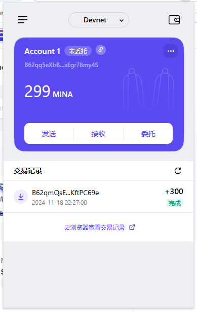

# Mina 协议技术解析

## 概述Mina所采用的证明系统(包括名称、特点)

Mina采用了Kimchi —— 一种专为高性能区块链定制的zkSNARK实现。通过巧妙运用递归特性，Kimchi让Mina成为第一个真正实现轻量级的区块链。

### zkSNARK核心特性 ✨

🔒 零知识性
- 证明者可向验证者证明某个命题，无需暴露任何实际数据。
- 在Mina中实现了交易验证的隐私保护，只需证明有效性而非公开细节。

📏 简洁性
- 证明文件仅几百字节，验证时间毫秒级。
- 是Mina实现"恒定大小区块链"的关键技术支撑。

📡 非交互性
- 单次证明即可，验证者可独立完成验证。
- 极大提升了网络效率，适合去中心化环境。

📜 知识论证
- 证明者不仅证明命题为真，还证明掌握相关信息。
- 为Mina的链上操作提供可信保障。

Kimchi特性 🌟
🔐 无需可信设置
- 突破传统zkSNARK需要可信设置的限制。
- 进一步增强了系统安全性和去中心化程度。

🔄 支持无限递归
- 高效处理递归证明，性能不随链增长而下降。
- 是实现恒定链大小的核心技术创新。

⚡ 优化性能
- 针对区块链场景优化的证明生成和验证。
- 满足高并发环境下的性能需求。

zkSNARK-PLONK家族特性 📚
- zkSNARK: 可以在不透露隐私的情况下，证明证明者确实拥有符合条件的能力。
- zkSNARK-PLONK家族特点:
🏆 简化可信设置（simplified trusted setup）。
♻️ 递归zkSNARK支持。
🛠️ 通用零知识证明（general-purpose ZKP）。
📏 小证明文件大小。

## 概述递归零知识证明在 Mina 共识过程中的应用

- 隐私保护：验资、匿名投票、隐私交易
- 计算压缩：区块链扩容（Layer1-Mina, Layer2-zkRollup）

🔄 递归证明原理 
- 采用Proof(n) -> Proof(n-1) -> ... -> Proof(0)结构
- 每个电路生成的证明会作为参数传递到下一个电路中验证
- 后续的每个证明可以追溯到最原始的证明，确保链条的整体正确性

📉 22KB
- 通过递归证明将整条链压缩至22KB固定大小
- 每个新区块包含自身证明和历史递归证明
- 最终实现单一证明包含全链状态，极大减少存储需求

## 下载安装 Auro wallet，创建账户，并完成领水

## Transaction Hash
5Juwxs3qcBKw3eNL1WNgzaKLMGoA1am9uQDGu5aEwmG3ZAFZK9f3
